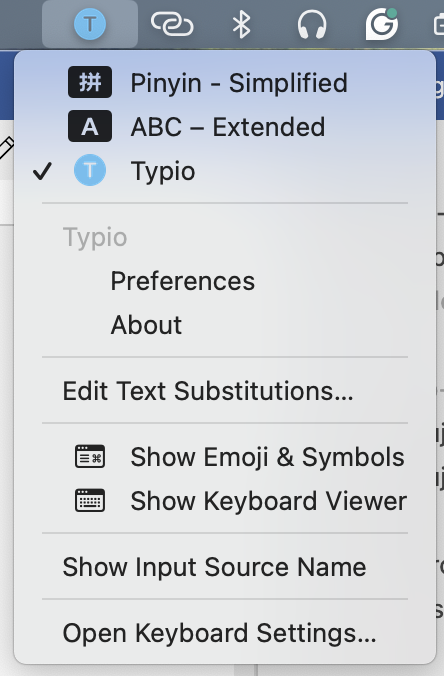
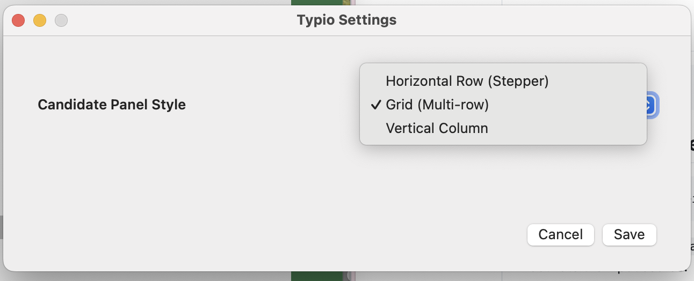

# Typio

[English](README.md) · [简体中文](README.zh-CN.md) · [日本語](README.ja.md) · [한국어](README.ko.md)

Typio is an English IEM for non-native speakers on macOS.

It is designed for people who write in English daily but still lose flow on spelling, word choice, or constant input method switching.

Typio is especially useful for Korean, Japanese, and Chinese users who want an English-first typing experience instead of full Chinese IME behavior.

Everything is local-first: no cloud dependency, no sign-in flow, and no extra distractions. You type, Typio suggests practical candidates, and you keep writing.

Typio means the end of typo.

## Why Typio

- ✍️ **Stay in flow**: keep typing while candidates update in place.
- 🧠 **Practical suggestions**: focused on high-frequency English usage.
- 🧩 **Flexible panel styles**: horizontal, grid (multi-row), and vertical layouts.
- 🔒 **Private by default**: all input processing stays local.

## Screenshots

<table>
	<tr>
		<td align="center"><strong>Input Source Menu</strong></td>
		<td align="center"><strong>Language Mode Switch</strong></td>
	</tr>
	<tr>
		<td align="center"></td>
		<td align="center"></td>
	</tr>
	<tr>
		<td align="center"><strong>Multi-row Candidate Panel</strong></td>
		<td align="center"><strong>Settings: Panel Style</strong></td>
	</tr>
	<tr>
		<td align="center"></td>
		<td align="center"></td>
	</tr>
</table>

## Install

For end users, download and run `typio-<version>.pkg`, then enable Typio in System Settings → Keyboard → Input Sources.

In most cases, logout is not required. If Typio does not appear immediately, remove and add the source once. If it still does not show, log out and log back in.

## Build and Package

Use `sh scripts/build.sh` to build the app, `sh scripts/build-and-install.sh` for local developer install, and `sh scripts/package-pkg.sh` to generate the installer package at `dist/typio-<version>.pkg`.

If you need installer signing, set `INSTALLER_SIGN_IDENTITY` before packaging.

## About

Project home: https://github.com/howtoexitvim/Typio
